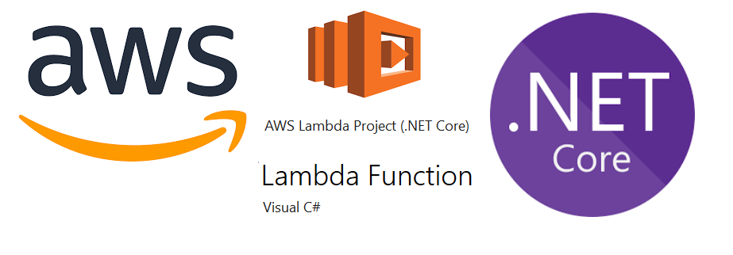

# serverless-core

### A serverless .NET Core application that uses Amazon API Gateway to expose a [Lambda](https://aws.amazon.com/lambda/) function as a RESTful API, secured by AWS Cognito, and consumed by the [material-cv](https://github.com/mikeacosta/material-cv) mobile app.

---

